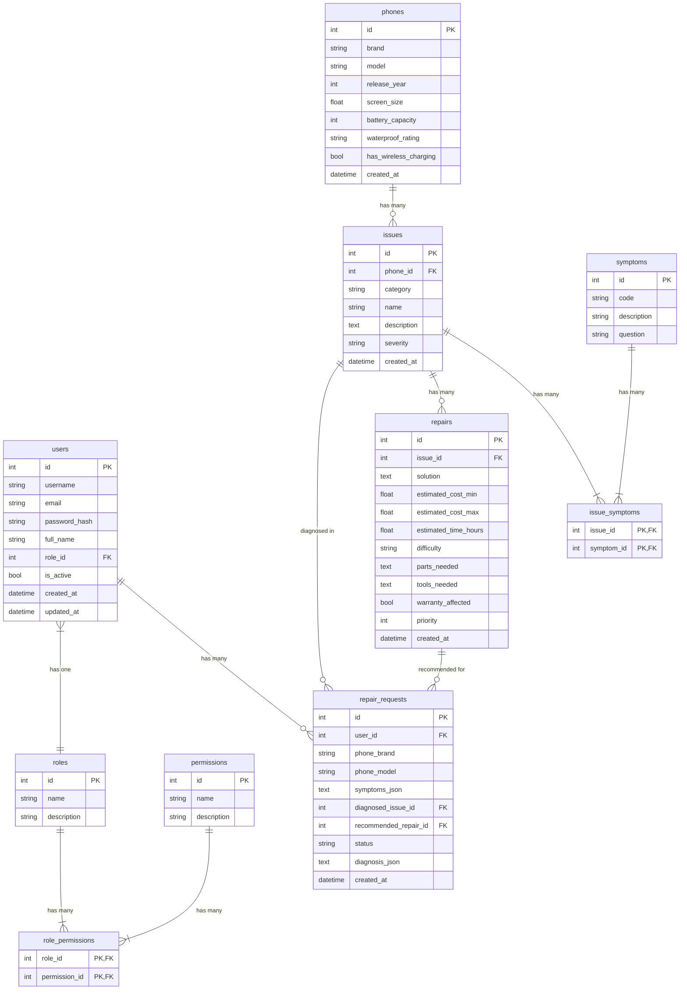

```mermaid
erDiagram
    users {
        int id PK
        string username
        string email
        string password_hash
        string full_name
        int role_id FK
        bool is_active
        datetime created_at
        datetime updated_at
    }

    roles {
        int id PK
        string name
        string description
    }

    permissions {
        int id PK
        string name
        string description
    }

    role_permissions {
        int role_id PK, FK
        int permission_id PK, FK
    }

    phones {
        int id PK
        string brand
        string model
        int release_year
        float screen_size
        int battery_capacity
        string waterproof_rating
        bool has_wireless_charging
        datetime created_at
    }

    issues {
        int id PK
        int phone_id FK
        string category
        string name
        text description
        string severity
        datetime created_at
    }

    symptoms {
        int id PK
        string code
        string description
        string question
    }

    issue_symptoms {
        int issue_id PK, FK
        int symptom_id PK, FK
    }

    repairs {
        int id PK
        int issue_id FK
        text solution
        float estimated_cost_min
        float estimated_cost_max
        float estimated_time_hours
        string difficulty
        text parts_needed
        text tools_needed
        bool warranty_affected
        int priority
        datetime created_at
    }

    repair_requests {
        int id PK
        int user_id FK
        string phone_brand
        string phone_model
        text symptoms_json
        int diagnosed_issue_id FK
        int recommended_repair_id FK
        string status
        text diagnosis_json
        datetime created_at
    }

    users ||--o{ repair_requests : "has many"
    users }|--|| roles : "has one"
    roles ||--|{ role_permissions : "has many"
    permissions ||--|{ role_permissions : "has many"
    phones ||--o{ issues : "has many"
    issues ||--|{ issue_symptoms : "has many"
    symptoms ||--|{ issue_symptoms : "has many"
    issues ||--o{ repairs : "has many"
    issues ||--o{ repair_requests : "diagnosed in"
    repairs ||--o{ repair_requests : "recommended for"
```
